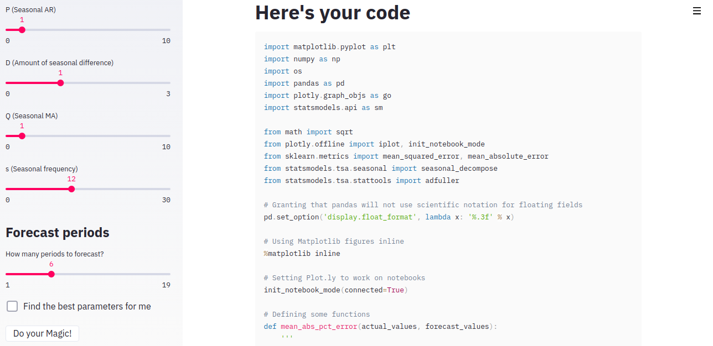

# Project: Alchemy
*A interactive tool for time series experimentation*

Alchemy is an open-source framework that aims to make it **easier to model and experiment time series analysis and forecasting**. Alchemy offers a intuitive and interactive interface to explore different parameters for models using Autoregressive models (AR, ARMA, ARIMA, SARIMA, ARIMAX, and SARIMAX). More estimators and algorithms are on the way.

## Features

* **Support to exogenous regressors** (independent variables)
* Seasonal decompose that let's you know the **Trend, Seasonality and Resid** of your data
* Stationarity Test using **Augmented Dickey-Fuller** test
* Customization of data transforming for stationarity: you can use from first difference to seasonal log to transform your data
* **ACF** (Autocorrelation function) and **PACF** (Parcial correlation function) for terms estimation
* Customize ARIMA terms or **let Alchemy choose the best for you** based on your data
* **Grid search** feature for parameters tuning
* Code generation: at the end of the process, Alchemy returns the code used in the process

# Getting started
Alchemy can be used in three different ways:

## Web
If you are just curious about what you can do with Alchemy, **[you can refer to this website](https://project-alchemy.herokuapp.com)**. This version contains some example datasets that you can use to check how Alchemy works.

## Docker
Run the following commands to use Alchemy with Docker (requires **Docker and Docker-compose**):

```bash
# Run the docker compose
docker-compose up --build
```

## Local installation (requirements.txt)
**Tip**: we recommend you to use Anaconda environments

```bash
# Clone the repository
git clone https://github.com/paulozip/alchemy.git
cd alchemy

# If you're using Anaconda
conda create --name alchemy_env
conda activate alchemy_env

# Install dependencies
pip install requirements.txt

# Run Streamlit
streamlit run run.py
```
# Upload your data
A [Upload file support will be added to Alchemy](https://github.com/paulozip/alchemy/issues/4), but you can use the Alchemy REST API to send your dataset. Here's an example of how you can use it using cURL:

```bash
curl -X POST \
  http://SERVER_ADDRESS:5000/upload_file \
  -H 'content-type: multipart/form-data' \       
  -F file=@PATH_TO_YOUR_FILE
```

Example:
```bash
curl -X POST \
  http://0.0.0.0:5000/upload_file \
  -H 'content-type: multipart/form-data' \       
  -F file=@/home/my_user/Downloads/dataset.csv
```

# Your data, your code
At the end of the process, Alchemy will give you the source code used to make the exploration and training. Use this code to adapt your work and make modifications at will:



# Next steps
Currently, this is an one-person project, but help is always welcome. **[You can suggest new ideas and features for us in our issue tracking](https://github.com/paulozip/alchemy/issues). Requests will be prioritized by thumbs up emoji** (👍).

**If you want to collaborate with this project**, all you need to do is fork this repository, make new additions and modifications, and open a PR. I will validate it ASAP. 

# A big thank you
This project would not be possible without (Streamlit)[https://github.com/streamlit/streamlit]: an awesome tool to build ML tools. Please refer to their Github repository to know further, or you can also (check their blog post)[https://towardsdatascience.com/coding-ml-tools-like-you-code-ml-models-ddba3357eace]